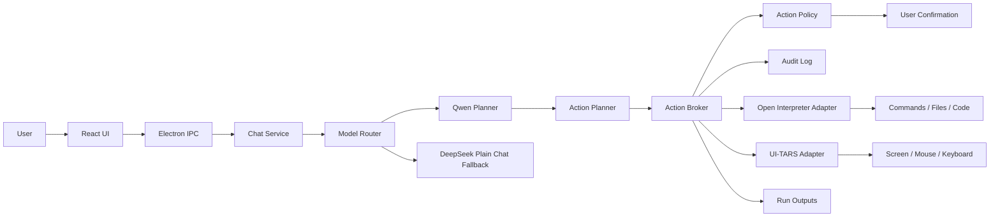

# AionUi V2 Final Delivery Implementation Plan

> **For agentic workers:** REQUIRED SUB-SKILL: Use superpowers:subagent-driven-development (recommended) or superpowers:executing-plans to implement this plan task-by-task. Steps use checkbox (`- [ ]`) syntax for tracking.

**Goal:** Build AionUi V2 from `origin/main` into a final Windows desktop release where Qwen plans tasks, Open Interpreter executes command/file/code work, UI-TARS performs screen/mouse/keyboard operations, and AionUi controls permissions, confirmations, safety policy, runtime setup, logs, and packaging.

**Architecture:** AionUi is the control plane. The renderer shows chat, control center, runtime setup, pending approvals, audit logs, and outputs. Electron main owns model routing, task orchestration, action policy, audit logging, runtime bootstrapping, and adapters. Qwen is the only Phase 1 model allowed to produce execution plans and action proposals; Open Interpreter and UI-TARS are default product capabilities but run through managed adapters and cannot bypass AionUi policy.

**Tech Stack:** Electron 33, React/Vite/Tailwind, Node.js CommonJS main process, Vitest, Qwen hosted OpenAI-compatible API through Alibaba Cloud Model Studio or DashScope-compatible endpoint, optional DeepSeek plain-chat fallback, managed external Open Interpreter sidecar, managed UI-TARS Desktop/SDK/fork runtime, JSONL audit storage, Windows electron-builder NSIS packaging.

---

## 0. How Codex Should Use This Plan

This is the direct-to-final delivery plan. Use it as the source of truth over older plans.

Execution rules:

- Start from `origin/main`, not `dev`.
- Create `codex/aionui-v2`.
- Work task by task in order.
- Commit after each task.
- Run the exact verification listed for each task.
- Do not copy large code from `dev`; only cherry-pick small ideas after reading them.
- Do not vendor Open Interpreter AGPL source into this repository.
- Keep every Open Interpreter and UI-TARS action behind AionUi's action broker.
- When an external runtime is missing, implement dry-run and setup guidance instead of failing the app.

## 1. Confirmed Product Decisions

- Qwen is the primary model for task planning, action intent, and coding reasoning.
- Recommended hosted defaults: `qwen-max-latest` for general planning and `qwen3-coder-plus` or available Qwen3-Coder endpoint for code-heavy tasks.
- DeepSeek is optional plain-chat fallback only.
- Open Interpreter is a default AionUi execution feature, integrated as a managed external sidecar or external fork/patch set. Do not place Open Interpreter AGPL source inside this repository.
- UI-TARS is a default AionUi screen-control feature. UI-TARS Desktop is Apache-2.0, so source-level adaptation, fork maintenance, or adapter-service integration is allowed with notices preserved.
- High-risk actions always require explicit confirmation.
- The old Office generator, diagnosis OCR/UIA/rule detector, experience library, heavy workflow system, and project indexing are not final V2 core features.

## 2. Verified External Sources

Use these sources when implementation details need re-checking:

- Qwen3-Coder official blog: Qwen3-Coder is positioned for agentic coding, browser use, tool use, long context, and Qwen Code integration. https://qwenlm.github.io/blog/qwen3-coder/
- Qwen-Agent official repo: supports planning, tool usage, function calling, MCP, Code Interpreter, RAG, and Qwen3/Qwen3-Coder tool-call demos. https://github.com/QwenLM/Qwen-Agent
- Open Interpreter official repo: executes generated local code and warns that local execution can affect files/system settings; it asks for confirmation by default and is AGPL-3.0. https://github.com/OpenInterpreter/open-interpreter
- UI-TARS Desktop official repo: open-source multimodal AI agent stack for native GUI agent workflows; license is Apache-2.0. https://github.com/bytedance/UI-TARS-desktop

## 3. Final Product Scope

Final V2 must ship these user-visible features:

- Chat surface with normal chat and execution task mode.
- Models and Runtimes setup panel for Qwen, optional DeepSeek, Open Interpreter, and UI-TARS.
- Control Center showing current task, proposed actions, pending approvals, running actions, completed actions, failed actions, and emergency stop.
- Structured confirmation UI for medium and high risk actions.
- Audit Logs panel with filters, session timeline, sanitized detail view, and export.
- Run Outputs panel replacing the old document/artifact-first surface.
- Dry-run demo mode for Qwen planning, Open Interpreter execution, and UI-TARS screen control when external runtimes are unavailable.
- Managed runtime health checks and setup/repair guidance.
- Windows installer build and final delivery documentation.

Final V2 must not ship these as core:

- Account login/register.
- Word/PPT as main product feature.
- Old direct shell/file tool execution from the model.
- Old built-in OCR/UIA diagnostic stack.
- Old experience library.
- Heavy workflow marketplace/versioning system.
- Background autonomous execution without visible task session.

## 4. Final Architecture



Non-negotiable invariant:

- The model proposes actions.
- AionUi validates and classifies actions.
- The user approves risky actions.
- Adapters execute approved actions.
- Audit log records everything.

## 5. Data Contracts

### Runtime Names

```json
["qwen", "deepseek", "open-interpreter", "ui-tars", "aionui-dry-run"]
```

### Model Roles

```json
{
  "plain-chat": "Qwen by default, DeepSeek fallback allowed",
  "task-planning": "Qwen required",
  "action-intent": "Qwen required",
  "coding-reasoning": "Qwen Coder or Qwen Max required"
}
```

### ActionProposal

```json
{
  "id": "act_20260508_000001",
  "sessionId": "sess_20260508_000001",
  "runtime": "open-interpreter",
  "type": "shell.command",
  "title": "Run test suite",
  "summary": "Run npm test in the selected workspace.",
  "payload": {
    "command": "npm test",
    "cwd": "C:\\Users\\g\\Desktop\\agent-platform"
  },
  "risk": "medium",
  "requiresConfirmation": true,
  "status": "pending",
  "createdAt": "2026-05-08T00:00:00.000Z"
}
```

### ActionResult

```json
{
  "actionId": "act_20260508_000001",
  "ok": true,
  "exitCode": 0,
  "stdout": "sanitized output",
  "stderr": "",
  "filesChanged": [],
  "durationMs": 1200,
  "completedAt": "2026-05-08T00:00:01.200Z"
}
```

### AuditEvent

```json
{
  "id": "audit_20260508_000001",
  "sessionId": "sess_20260508_000001",
  "actionId": "act_20260508_000001",
  "runtime": "open-interpreter",
  "type": "shell.command",
  "phase": "approved",
  "risk": "medium",
  "summary": "User approved npm test",
  "sanitizedPayload": {
    "command": "npm test",
    "cwd": "C:\\Users\\g\\Desktop\\agent-platform"
  },
  "createdAt": "2026-05-08T00:00:00.100Z"
}
```

## 6. File Map

Create main-process modules:

- `electron/services/models/modelTypes.js`: model providers, roles, default names, capability constants.
- `electron/services/models/qwenProvider.js`: OpenAI-compatible Qwen client.
- `electron/services/models/deepseekProvider.js`: plain-chat fallback wrapper around existing DeepSeek service.
- `electron/services/modelRouter.js`: selects model by role and verifies provider readiness.
- `electron/services/actionPlanner.js`: validates Qwen structured output into action proposals.
- `electron/security/actionTypes.js`: runtime names, action type names, risk levels, status constants.
- `electron/security/actionPolicy.js`: pure policy evaluator.
- `electron/security/actionBroker.js`: pending action queue, confirmation flow, adapter dispatch, cancellation, emergency stop.
- `electron/security/auditLog.js`: append-only JSONL audit log.
- `electron/services/openInterpreter/protocol.js`: sidecar request/result schema.
- `electron/services/openInterpreter/processManager.js`: start/stop/status for managed external runtime.
- `electron/services/openInterpreter/bootstrap.js`: detect/install/repair guidance.
- `electron/services/openInterpreter/patchManifest.js`: external fork/patch metadata.
- `electron/services/openInterpreter/adapter.js`: broker-approved action execution.
- `electron/services/uiTars/protocol.js`: visual/input request/result schema.
- `electron/services/uiTars/processManager.js`: start/stop/status for UI-TARS runtime.
- `electron/services/uiTars/bootstrap.js`: detect/install/repair guidance.
- `electron/services/uiTars/sourceBridge.js`: stable protocol boundary for source-adapted UI-TARS.
- `electron/services/uiTars/adapter.js`: broker-approved visual/input action execution.
- `electron/services/dryRunRuntime.js`: deterministic dry-run runtime for tests and demos.
- `electron/services/taskOrchestrator.js`: turns user task into model plan, action proposals, broker execution, and final response.
- `electron/services/runOutputs.js`: stores generated files, command summaries, screenshots metadata, and run artifacts.
- `electron/ipc/runtime.js`: runtime status, configure, bootstrap, start, stop.
- `electron/ipc/actions.js`: list pending/running/completed, approve, deny, cancel, emergency stop.
- `electron/ipc/audit.js`: list/filter/export audit events.
- `electron/ipc/outputs.js`: list/open/export run outputs.

Modify existing main-process modules:

- `electron/ipc/index.js`: register runtime/actions/audit/outputs modules.
- `electron/ipc/chat.js`: route execution mode through `taskOrchestrator`.
- `electron/ipc/config.js`: support model/runtime/safety config.
- `electron/services/deepseek.js`: keep as provider implementation, not default execution brain.
- `electron/confirm.js`: add structured action confirmation payloads.
- `electron/store.js`: persist model/runtime/safety/output/audit settings.
- `electron/tools/index.js`: keep legacy tools hidden from Qwen execution mode.
- `electron/preload.js`: expose runtime/action/audit/output IPC helpers.

Create renderer modules:

- `client/src/panels/ControlCenterPanel.jsx`
- `client/src/panels/RuntimeStatusPanel.jsx`
- `client/src/panels/LogsPanel.jsx`
- `client/src/panels/RunOutputsPanel.jsx`
- `client/src/components/actions/ActionCard.jsx`
- `client/src/components/actions/ActionConfirmModal.jsx`
- `client/src/components/actions/RiskBadge.jsx`
- `client/src/components/runtime/RuntimeCard.jsx`
- `client/src/components/runtime/SetupGuide.jsx`
- `client/src/hooks/useRuntimeStatus.js`
- `client/src/hooks/useActionQueue.js`
- `client/src/hooks/useAuditLog.js`
- `client/src/hooks/useRunOutputs.js`

Modify existing renderer modules:

- `client/src/components/layout/RightDrawer.jsx`: replace old side tabs with Control, Models/Runtimes, Logs, Outputs, Settings.
- `client/src/components/layout/Sidebar.jsx`: rename product to AionUi.
- `client/src/components/layout/TopBar.jsx`: add execution mode and emergency stop state.
- `client/src/components/chat/ChatArea.jsx`: show action planning and action progress.
- `client/src/components/chat/MessageList.jsx`: render action cards.
- `client/src/components/chat/ToolCard.jsx`: keep only as compatibility or replace with `ActionCard`.
- `client/src/panels/SettingsPanel.jsx`: model/runtime/safety settings.
- `client/src/panels/ArtifactsPanel.jsx`: reduce to run outputs or remove after `RunOutputsPanel` is ready.
- `client/src/lib/api.js`: add wrappers.

Tests to create:

- `electron/__tests__/model-router.test.js`
- `electron/__tests__/qwen-provider.test.js`
- `electron/__tests__/action-planner.test.js`
- `electron/__tests__/action-policy.test.js`
- `electron/__tests__/audit-log.test.js`
- `electron/__tests__/action-broker.test.js`
- `electron/__tests__/open-interpreter-bootstrap.test.js`
- `electron/__tests__/open-interpreter-adapter.test.js`
- `electron/__tests__/ui-tars-bootstrap.test.js`
- `electron/__tests__/ui-tars-adapter.test.js`
- `electron/__tests__/dry-run-runtime.test.js`
- `electron/__tests__/runtime-ipc.test.js`
- `electron/__tests__/actions-ipc.test.js`
- `electron/__tests__/audit-ipc.test.js`
- `electron/__tests__/outputs-ipc.test.js`
- `electron/__tests__/task-orchestrator.test.js`
- `client/src/lib/api.test.js`

## 7. Implementation Plan

### Task 1: Create Clean V2 Workspace

**Files:**

- No source edits.

- [ ] Run:

```powershell
git fetch origin
git worktree add ..\agent-platform-aionui-v2 -b codex/aionui-v2 origin/main
cd ..\agent-platform-aionui-v2
npm run setup
npm test
npm run build:client
```

- [ ] Expected: current branch is `codex/aionui-v2`.
- [ ] Expected: tests pass from baseline or failures are documented before feature work.
- [ ] Expected: client build passes from baseline.

Commit: none.

### Task 2: Copy Final Plan Into V2 Workspace

**Files:**

- Create: `docs/superpowers/plans/2026-05-08-aionui-v2-final-delivery-plan.md`
- Keep: `docs/superpowers/plans/2026-05-08-aionui-v2-main-framework.md` if useful as reference.

- [ ] Copy this file into the new worktree.
- [ ] Run:

```powershell
git add docs/superpowers/plans/2026-05-08-aionui-v2-final-delivery-plan.md
git commit -m "docs: add aionui v2 final delivery plan"
```

Acceptance:

- The new branch contains the final plan as the first commit.

### Task 3: Rebrand Product And Remove Old Positioning

**Files:**

- Modify: `README.md`
- Modify: `docs/USER_MANUAL.md`
- Modify: `client/src/components/layout/Sidebar.jsx`
- Modify: `client/src/components/layout/TopBar.jsx`
- Modify: `package.json`
- Test: `electron/__tests__/packaging.test.js`

- [ ] Rename user-facing product identity to AionUi.
- [ ] Replace document-generator/student-assistant language with control-plane language.
- [ ] Keep package name stable unless electron-builder requires a new product name.
- [ ] Run:

```powershell
npm test -- electron/__tests__/packaging.test.js
npm run build:client
```

Commit:

```powershell
git add README.md docs/USER_MANUAL.md client/src/components/layout/Sidebar.jsx client/src/components/layout/TopBar.jsx package.json
git commit -m "docs: define aionui v2 product identity"
```

Acceptance:

- The first screen and docs describe Qwen + Open Interpreter + UI-TARS + AionUi responsibilities.

### Task 4: Add Model Router And Qwen Provider

**Files:**

- Create: `electron/services/models/modelTypes.js`
- Create: `electron/services/models/qwenProvider.js`
- Create: `electron/services/models/deepseekProvider.js`
- Create: `electron/services/modelRouter.js`
- Modify: `electron/services/deepseek.js`
- Modify: `electron/store.js`
- Modify: `electron/ipc/config.js`
- Test: `electron/__tests__/model-router.test.js`
- Test: `electron/__tests__/qwen-provider.test.js`

- [ ] Add roles `plain-chat`, `task-planning`, `action-intent`, `coding-reasoning`.
- [ ] Add config keys `qwenApiKey`, `qwenBaseUrl`, `qwenPrimaryModel`, `qwenCodingModel`, `fallbackProvider`, `fallbackModel`, `deepseekApiKey`, `deepseekBaseUrl`.
- [ ] Default Qwen base URL to an OpenAI-compatible DashScope/Model Studio endpoint value stored in config.
- [ ] Ensure `selectModelForRole('action-intent')` always returns Qwen or an error.
- [ ] Ensure DeepSeek can only be returned for `plain-chat`.
- [ ] Run:

```powershell
npm test -- electron/__tests__/model-router.test.js electron/__tests__/qwen-provider.test.js
```

Commit:

```powershell
git add electron/services/models electron/services/modelRouter.js electron/services/deepseek.js electron/store.js electron/ipc/config.js electron/__tests__/model-router.test.js electron/__tests__/qwen-provider.test.js
git commit -m "feat: add qwen model router"
```

Acceptance:

- Execution planning fails closed if Qwen is not configured.
- Plain chat can still use Qwen or optional DeepSeek fallback.

### Task 5: Add Action Planner

**Files:**

- Create: `electron/services/actionPlanner.js`
- Test: `electron/__tests__/action-planner.test.js`

- [ ] Define Qwen structured output contract for `ActionProposal[]`.
- [ ] Parse JSON from model output.
- [ ] Reject unknown runtime names.
- [ ] Reject unknown action types.
- [ ] Generate stable local action IDs if the model omits IDs.
- [ ] Add safe summaries for display.
- [ ] Run:

```powershell
npm test -- electron/__tests__/action-planner.test.js
```

Commit:

```powershell
git add electron/services/actionPlanner.js electron/__tests__/action-planner.test.js
git commit -m "feat: validate qwen action plans"
```

Acceptance:

- Malformed Qwen output never reaches the action broker.

### Task 6: Add Action Types And Policy Engine

**Files:**

- Create: `electron/security/actionTypes.js`
- Create: `electron/security/actionPolicy.js`
- Test: `electron/__tests__/action-policy.test.js`

- [ ] Define runtime names, action types, risk levels, action statuses.
- [ ] Implement shell risk classification.
- [ ] Implement file risk classification.
- [ ] Implement code execution risk classification.
- [ ] Implement UI-TARS screen/input risk classification.
- [ ] Block credential exfiltration, disk formatting, hidden background execution, unbounded recursive delete, and disabling security tooling.
- [ ] Run:

```powershell
npm test -- electron/__tests__/action-policy.test.js
```

Commit:

```powershell
git add electron/security/actionTypes.js electron/security/actionPolicy.js electron/__tests__/action-policy.test.js
git commit -m "feat: add action policy engine"
```

Acceptance:

- Low, medium, high, and blocked cases are tested.
- High-risk actions always require confirmation.

### Task 7: Add Audit Log

**Files:**

- Create: `electron/security/auditLog.js`
- Modify: `electron/store.js`
- Test: `electron/__tests__/audit-log.test.js`

- [ ] Store events as JSONL under app data.
- [ ] Mask secrets in command strings, env vars, file content snippets, URLs, headers, and logs.
- [ ] Implement `appendAuditEvent`, `listAuditEvents`, `exportAuditEvents`.
- [ ] Add filters by session, runtime, risk, phase, and text.
- [ ] Run:

```powershell
npm test -- electron/__tests__/audit-log.test.js
```

Commit:

```powershell
git add electron/security/auditLog.js electron/store.js electron/__tests__/audit-log.test.js
git commit -m "feat: add sanitized audit log"
```

Acceptance:

- Logs are append-only.
- Exported logs contain no obvious secrets.

### Task 8: Add Action Broker

**Files:**

- Create: `electron/security/actionBroker.js`
- Modify: `electron/confirm.js`
- Test: `electron/__tests__/action-broker.test.js`

- [ ] Implement pending queue.
- [ ] Evaluate every action through policy.
- [ ] Auto-run low risk actions only when policy allows.
- [ ] Pause medium/high actions for confirmation.
- [ ] Reject blocked actions.
- [ ] Dispatch approved actions to registered adapters.
- [ ] Implement deny, cancel session, and emergency stop.
- [ ] Write audit events for proposed, approved, denied, started, completed, failed, blocked, cancelled.
- [ ] Run:

```powershell
npm test -- electron/__tests__/action-broker.test.js
```

Commit:

```powershell
git add electron/security/actionBroker.js electron/confirm.js electron/__tests__/action-broker.test.js
git commit -m "feat: add action broker"
```

Acceptance:

- No adapter can execute without broker approval.

### Task 9: Add Open Interpreter Default Runtime

**Files:**

- Create: `electron/services/openInterpreter/protocol.js`
- Create: `electron/services/openInterpreter/processManager.js`
- Create: `electron/services/openInterpreter/bootstrap.js`
- Create: `electron/services/openInterpreter/patchManifest.js`
- Create: `electron/services/openInterpreter/adapter.js`
- Test: `electron/__tests__/open-interpreter-bootstrap.test.js`
- Test: `electron/__tests__/open-interpreter-adapter.test.js`

- [ ] Show Open Interpreter as a default capability even before installation.
- [ ] Detect configured executable, `interpreter` on PATH, and Python environment candidates.
- [ ] Provide setup guidance using user-approved commands.
- [ ] Keep Open Interpreter source external.
- [ ] Implement adapter actions: `shell.command`, `file.read`, `file.write`, `file.delete`, `code.run`, `package.install`.
- [ ] Normalize output to `ActionResult`.
- [ ] Run:

```powershell
npm test -- electron/__tests__/open-interpreter-bootstrap.test.js electron/__tests__/open-interpreter-adapter.test.js
```

Commit:

```powershell
git add electron/services/openInterpreter electron/__tests__/open-interpreter-bootstrap.test.js electron/__tests__/open-interpreter-adapter.test.js
git commit -m "feat: add open interpreter runtime"
```

Acceptance:

- Missing runtime is recoverable.
- Runtime setup commands still require confirmation.
- Open Interpreter AGPL source is not vendored.

### Task 10: Add UI-TARS Default Runtime

**Files:**

- Create: `electron/services/uiTars/protocol.js`
- Create: `electron/services/uiTars/processManager.js`
- Create: `electron/services/uiTars/bootstrap.js`
- Create: `electron/services/uiTars/sourceBridge.js`
- Create: `electron/services/uiTars/adapter.js`
- Test: `electron/__tests__/ui-tars-bootstrap.test.js`
- Test: `electron/__tests__/ui-tars-adapter.test.js`

- [ ] Show UI-TARS as a default capability even before installation.
- [ ] Detect configured UI-TARS Desktop/SDK/fork endpoint.
- [ ] Provide setup and repair guidance.
- [ ] Implement adapter actions: `screen.observe`, `screen.region.select`, `mouse.move`, `mouse.click`, `keyboard.type`, `keyboard.shortcut`.
- [ ] Require active screen authorization for all UI-TARS actions.
- [ ] Require confirmation for mouse and keyboard actions unless explicitly low-risk and session-authorized.
- [ ] Run:

```powershell
npm test -- electron/__tests__/ui-tars-bootstrap.test.js electron/__tests__/ui-tars-adapter.test.js
```

Commit:

```powershell
git add electron/services/uiTars electron/__tests__/ui-tars-bootstrap.test.js electron/__tests__/ui-tars-adapter.test.js
git commit -m "feat: add ui tars runtime"
```

Acceptance:

- No GUI action runs without screen authorization.
- UI-TARS source adaptations stay behind `sourceBridge`.

### Task 11: Add Dry-Run Runtime

**Files:**

- Create: `electron/services/dryRunRuntime.js`
- Test: `electron/__tests__/dry-run-runtime.test.js`

- [ ] Simulate Qwen-generated actions.
- [ ] Simulate Open Interpreter command/file/code results.
- [ ] Simulate UI-TARS screen observe/click/type results.
- [ ] Label all dry-run output clearly.
- [ ] Run:

```powershell
npm test -- electron/__tests__/dry-run-runtime.test.js
```

Commit:

```powershell
git add electron/services/dryRunRuntime.js electron/__tests__/dry-run-runtime.test.js
git commit -m "test: add dry run runtime"
```

Acceptance:

- Full product demo works without external runtime installs.

### Task 12: Add Runtime, Action, Audit, Output IPC

**Files:**

- Create: `electron/ipc/runtime.js`
- Create: `electron/ipc/actions.js`
- Create: `electron/ipc/audit.js`
- Create: `electron/ipc/outputs.js`
- Modify: `electron/ipc/index.js`
- Modify: `electron/preload.js`
- Test: `electron/__tests__/runtime-ipc.test.js`
- Test: `electron/__tests__/actions-ipc.test.js`
- Test: `electron/__tests__/audit-ipc.test.js`
- Test: `electron/__tests__/outputs-ipc.test.js`

- [ ] Add runtime status/config/bootstrap/start/stop IPC.
- [ ] Add pending/running/completed/approve/deny/cancel/emergency-stop IPC.
- [ ] Add audit list/filter/export IPC.
- [ ] Add run outputs list/open/export IPC.
- [ ] Return `{ ok: false, error }` for expected failures.
- [ ] Run:

```powershell
npm test -- electron/__tests__/runtime-ipc.test.js electron/__tests__/actions-ipc.test.js electron/__tests__/audit-ipc.test.js electron/__tests__/outputs-ipc.test.js
```

Commit:

```powershell
git add electron/ipc/runtime.js electron/ipc/actions.js electron/ipc/audit.js electron/ipc/outputs.js electron/ipc/index.js electron/preload.js electron/__tests__/runtime-ipc.test.js electron/__tests__/actions-ipc.test.js electron/__tests__/audit-ipc.test.js electron/__tests__/outputs-ipc.test.js
git commit -m "feat: expose runtime action audit ipc"
```

Acceptance:

- Renderer can control every default runtime through IPC.

### Task 13: Add Task Orchestrator

**Files:**

- Create: `electron/services/taskOrchestrator.js`
- Create: `electron/services/runOutputs.js`
- Modify: `electron/ipc/chat.js`
- Modify: `electron/tools/index.js`
- Test: `electron/__tests__/task-orchestrator.test.js`
- Test: `electron/__tests__/chat.test.js`

- [ ] Keep plain chat streaming.
- [ ] Add execution task mode.
- [ ] Route execution mode to Qwen planner.
- [ ] Validate Qwen output through action planner.
- [ ] Submit proposals to action broker.
- [ ] Store action results in run outputs.
- [ ] Summarize final result back to chat.
- [ ] Hide old destructive local tools from model execution mode.
- [ ] Run:

```powershell
npm test -- electron/__tests__/task-orchestrator.test.js electron/__tests__/chat.test.js
```

Commit:

```powershell
git add electron/services/taskOrchestrator.js electron/services/runOutputs.js electron/ipc/chat.js electron/tools/index.js electron/__tests__/task-orchestrator.test.js electron/__tests__/chat.test.js
git commit -m "feat: orchestrate qwen brokered tasks"
```

Acceptance:

- Execution task creates visible action proposals.
- Runtime failures become user-readable messages.

### Task 14: Add Models And Runtimes UI

**Files:**

- Create: `client/src/panels/RuntimeStatusPanel.jsx`
- Create: `client/src/components/runtime/RuntimeCard.jsx`
- Create: `client/src/components/runtime/SetupGuide.jsx`
- Create: `client/src/hooks/useRuntimeStatus.js`
- Modify: `client/src/panels/SettingsPanel.jsx`
- Modify: `client/src/lib/api.js`
- Test: `client/src/lib/api.test.js`

- [ ] Add Qwen configuration fields.
- [ ] Add optional DeepSeek fallback fields with plain-chat-only label.
- [ ] Add Open Interpreter card with ready/not installed/needs configuration/disabled/error states.
- [ ] Add UI-TARS card with ready/not installed/needs configuration/disabled/error states.
- [ ] Add setup/repair buttons that call bootstrap IPC.
- [ ] Run:

```powershell
npm test -- client/src/lib/api.test.js
npm run build:client
```

Commit:

```powershell
git add client/src/panels/RuntimeStatusPanel.jsx client/src/components/runtime client/src/hooks/useRuntimeStatus.js client/src/panels/SettingsPanel.jsx client/src/lib/api.js client/src/lib/api.test.js
git commit -m "feat: add models and runtimes ui"
```

Acceptance:

- User can configure and inspect Qwen, DeepSeek fallback, Open Interpreter, and UI-TARS.

### Task 15: Add Control Center UI

**Files:**

- Create: `client/src/panels/ControlCenterPanel.jsx`
- Create: `client/src/components/actions/ActionCard.jsx`
- Create: `client/src/components/actions/ActionConfirmModal.jsx`
- Create: `client/src/components/actions/RiskBadge.jsx`
- Create: `client/src/hooks/useActionQueue.js`
- Modify: `client/src/components/layout/RightDrawer.jsx`
- Modify: `client/src/components/layout/TopBar.jsx`
- Modify: `client/src/lib/api.js`

- [ ] Add Control tab.
- [ ] Show pending, running, completed, failed, denied, blocked actions.
- [ ] Add approve/deny buttons.
- [ ] Add emergency stop.
- [ ] Show risk badge and exact sanitized payload summary.
- [ ] Run:

```powershell
npm run build:client
```

Commit:

```powershell
git add client/src/panels/ControlCenterPanel.jsx client/src/components/actions client/src/hooks/useActionQueue.js client/src/components/layout/RightDrawer.jsx client/src/components/layout/TopBar.jsx client/src/lib/api.js
git commit -m "feat: add action control center"
```

Acceptance:

- User can approve/deny actions without leaving the app.
- Emergency stop is visible during active execution.

### Task 16: Add Logs And Outputs UI

**Files:**

- Create: `client/src/panels/LogsPanel.jsx`
- Create: `client/src/panels/RunOutputsPanel.jsx`
- Create: `client/src/hooks/useAuditLog.js`
- Create: `client/src/hooks/useRunOutputs.js`
- Modify: `client/src/components/layout/RightDrawer.jsx`
- Modify: `client/src/panels/ArtifactsPanel.jsx`
- Modify: `client/src/lib/api.js`

- [ ] Add Logs tab with filters.
- [ ] Add Outputs tab.
- [ ] Reduce old Artifacts panel to compatibility or replace it with Run Outputs.
- [ ] Add sanitized audit export.
- [ ] Add open output file action through existing safe dialog/file open flow.
- [ ] Run:

```powershell
npm run build:client
```

Commit:

```powershell
git add client/src/panels/LogsPanel.jsx client/src/panels/RunOutputsPanel.jsx client/src/hooks/useAuditLog.js client/src/hooks/useRunOutputs.js client/src/components/layout/RightDrawer.jsx client/src/panels/ArtifactsPanel.jsx client/src/lib/api.js
git commit -m "feat: add logs and run outputs ui"
```

Acceptance:

- User can answer what happened, what ran, what changed, and what output was produced.

### Task 17: Update Chat UI For Execution Mode

**Files:**

- Modify: `client/src/components/chat/ChatArea.jsx`
- Modify: `client/src/components/chat/InputBar.jsx`
- Modify: `client/src/components/chat/MessageList.jsx`
- Modify: `client/src/components/chat/ToolCard.jsx`
- Modify: `client/src/hooks/useChat.js`

- [ ] Add mode switch: Chat / Execute.
- [ ] In Execute mode, show that Qwen will plan and AionUi will ask before risky actions.
- [ ] Render action cards inside messages.
- [ ] Surface blocked and denied action explanations.
- [ ] Keep normal chat usable without configured runtimes.
- [ ] Run:

```powershell
npm run build:client
```

Commit:

```powershell
git add client/src/components/chat client/src/hooks/useChat.js
git commit -m "feat: add execution mode chat ui"
```

Acceptance:

- User understands whether they are chatting or asking the app to operate.

### Task 18: Remove Or Hide Legacy Core Surfaces

**Files:**

- Modify: `electron/tools/index.js`
- Modify: `electron/tools/docs.js`
- Modify: `resources/skills/word-writer/SKILL.md`
- Modify: `resources/skills/ppt-builder/SKILL.md`
- Modify: `client/src/panels/SkillsTab.jsx`
- Test: `electron/__tests__/tools.test.js`
- Test: `electron/__tests__/skills.test.js`

- [ ] Keep legacy tools only as compatibility helpers.
- [ ] Prevent legacy destructive tools from being exposed to Qwen execution mode.
- [ ] Make Office skills optional examples, not core product surface.
- [ ] Run:

```powershell
npm test -- electron/__tests__/tools.test.js electron/__tests__/skills.test.js
```

Commit:

```powershell
git add electron/tools/index.js electron/tools/docs.js resources/skills/word-writer/SKILL.md resources/skills/ppt-builder/SKILL.md client/src/panels/SkillsTab.jsx electron/__tests__/tools.test.js electron/__tests__/skills.test.js
git commit -m "refactor: hide legacy core tools"
```

Acceptance:

- V2 no longer feels like a Word/PPT/shell wrapper.

### Task 19: Security Review Pass

**Files:**

- Modify: `docs/security-policy.md`
- Modify: `README.md`
- Modify tests as needed.

- [ ] Review every path from model output to execution.
- [ ] Confirm all paths go through action planner, policy, broker, adapter.
- [ ] Confirm high-risk delete/install/type/submit/script actions require confirmation.
- [ ] Confirm audit export masks secrets.
- [ ] Confirm emergency stop affects queued and running actions where possible.
- [ ] Run:

```powershell
npm test
```

Commit:

```powershell
git add docs/security-policy.md README.md electron/__tests__ client/src
git commit -m "chore: complete safety review"
```

Acceptance:

- There is no known direct execution bypass.

### Task 20: Real Open Interpreter Integration

**Files:**

- Modify: `docs/USER_MANUAL.md`
- Modify: `README.md`

- [ ] Document install/configure flow.
- [ ] Document external sidecar and AGPL reason.
- [ ] Test command: run `npm test`.
- [ ] Test file write inside workspace.
- [ ] Test code execution with a small Python or JavaScript snippet.
- [ ] Confirm every action appears in Control and Logs.
- [ ] Run:

```powershell
npm test -- electron/__tests__/open-interpreter-adapter.test.js
```

Commit:

```powershell
git add docs/USER_MANUAL.md README.md
git commit -m "docs: document open interpreter integration"
```

Acceptance:

- User can enable Open Interpreter as a default AionUi execution capability.

### Task 21: Real UI-TARS Integration

**Files:**

- Modify: `docs/USER_MANUAL.md`
- Modify: `README.md`

- [ ] Document UI-TARS Desktop/SDK/fork setup.
- [ ] Document screen authorization.
- [ ] Test screen observe.
- [ ] Test mouse click proposal.
- [ ] Test keyboard type proposal.
- [ ] Test emergency stop before further UI action.
- [ ] Confirm every action appears in Control and Logs.
- [ ] Run:

```powershell
npm test -- electron/__tests__/ui-tars-adapter.test.js
```

Commit:

```powershell
git add docs/USER_MANUAL.md README.md
git commit -m "docs: document ui tars integration"
```

Acceptance:

- User can enable UI-TARS as a default AionUi screen-control capability.

### Task 22: End-To-End Dry-Run Demo

**Files:**

- Create: `docs/demo-script.md`
- Modify: `README.md`

- [ ] Add dry-run demo script: ask AionUi to inspect a fake screen, propose a click, run a fake command, write a fake output, and export logs.
- [ ] Verify demo works with no Qwen key by using deterministic dry-run model mode.
- [ ] Verify demo works with Qwen configured by using real planning and dry-run runtimes.
- [ ] Run:

```powershell
npm test
npm run build:client
```

Commit:

```powershell
git add docs/demo-script.md README.md
git commit -m "docs: add final dry run demo"
```

Acceptance:

- Codex or a human tester can demonstrate the full product without external runtime installs.

### Task 23: Final Documentation

**Files:**

- Modify: `README.md`
- Modify: `docs/USER_MANUAL.md`
- Create: `docs/developer-guide.md`
- Create: `docs/runtime-setup.md`
- Create: `docs/release-checklist.md`
- Create: `docs/test-report.md`

- [ ] Document first-run setup.
- [ ] Document Qwen configuration.
- [ ] Document Open Interpreter setup.
- [ ] Document UI-TARS setup.
- [ ] Document permission model and risk levels.
- [ ] Document audit log export.
- [ ] Document dry-run mode.
- [ ] Document final verification commands.
- [ ] Run:

```powershell
npm run build:client
```

Commit:

```powershell
git add README.md docs/USER_MANUAL.md docs/developer-guide.md docs/runtime-setup.md docs/release-checklist.md docs/test-report.md
git commit -m "docs: complete aionui v2 documentation"
```

Acceptance:

- A new developer can install, run, configure, test, and demo the app from docs.

### Task 24: Final Test And Build

**Files:**

- Modify: `package.json` only if packaging metadata needs final product name adjustment.
- Modify: `docs/test-report.md`
- Modify: `docs/release-checklist.md`

- [ ] Run:

```powershell
npm test
npm run build:client
npm run electron:build
```

- [ ] Manually launch packaged app.
- [ ] Verify normal chat.
- [ ] Verify dry-run execute mode.
- [ ] Verify Control Center approval.
- [ ] Verify Logs export.
- [ ] Verify Outputs panel.
- [ ] Verify runtime setup cards.
- [ ] Verify emergency stop.
- [ ] Update `docs/test-report.md`.
- [ ] Update `docs/release-checklist.md`.
- [ ] Commit:

```powershell
git add package.json docs/test-report.md docs/release-checklist.md
git commit -m "chore: finalize aionui v2 release"
```

Acceptance:

- Test suite passes.
- Client build passes.
- Windows package builds.
- Packaged app opens.

### Task 25: Final PR Preparation

**Files:**

- No required source edits unless release docs need final cleanup.

- [ ] Run:

```powershell
git status -sb
git log --oneline --decorate -10
```

- [ ] Push branch:

```powershell
git push -u origin codex/aionui-v2
```

- [ ] Create draft PR into `main`.
- [ ] PR title:

```text
feat: deliver AionUi V2 control-plane agent
```

- [ ] PR body must include:

```markdown
## Summary
- Adds Qwen-first task planning and action proposal flow.
- Adds AionUi action broker, policy engine, confirmations, audit logs, emergency stop.
- Adds default Open Interpreter execution runtime integration as managed external sidecar.
- Adds default UI-TARS screen-control runtime integration.
- Adds Control, Models/Runtimes, Logs, Outputs, and updated Settings UI.
- Adds dry-run mode and final delivery docs.

## Verification
- npm test
- npm run build:client
- npm run electron:build
- Manual packaged-app smoke test

## Safety
- High-risk actions require confirmation.
- Blocked actions never reach runtime adapters.
- Open Interpreter source remains external.
- UI-TARS actions require screen authorization.
```

Acceptance:

- Draft PR exists with complete verification notes.

## 8. Final Verification Matrix

| Area | Required Result | Verification |
| --- | --- | --- |
| Branch | `codex/aionui-v2` from `origin/main` | `git log --oneline main..HEAD` |
| Model | Qwen required for planning/action intent | `model-router.test.js` |
| DeepSeek | Plain chat fallback only | `model-router.test.js` |
| Policy | High-risk confirms, blocked denies | `action-policy.test.js` |
| Broker | No direct adapter bypass | `action-broker.test.js` |
| Audit | Sanitized append-only log | `audit-log.test.js` |
| Open Interpreter | Default capability, external runtime | adapter/bootstrap tests |
| UI-TARS | Default capability, screen authorization | adapter/bootstrap tests |
| Dry Run | Full demo without external runtimes | `dry-run-runtime.test.js` |
| UI | Control, Models/Runtimes, Logs, Outputs | `npm run build:client` and manual test |
| Package | Windows installer builds | `npm run electron:build` |

## 9. Final Acceptance Criteria

The project is final when all are true:

- User can configure Qwen.
- User can run normal chat.
- User can start an execution task.
- Qwen creates action proposals.
- AionUi displays proposed actions.
- User can approve or deny risky actions.
- Open Interpreter executes approved command/file/code actions.
- UI-TARS executes approved screen/mouse/keyboard actions.
- Emergency stop works.
- Audit logs record every meaningful event.
- Logs export without secrets.
- Dry-run demo works without external runtimes.
- Packaged Windows app builds and launches.
- README and user manual explain setup and safety.

## 10. Known Hard Boundaries

- Do not vendor Open Interpreter source into this repository.
- Do not allow UI-TARS mouse/keyboard actions without active screen authorization.
- Do not let model output directly execute commands.
- Do not make high-risk action confirmation optional.
- Do not make old Office/diagnostics/workflow features the product center again.
- Do not use `dev` as the base branch.

## 11. Suggested Commit Sequence

1. `docs: add aionui v2 final delivery plan`
2. `docs: define aionui v2 product identity`
3. `feat: add qwen model router`
4. `feat: validate qwen action plans`
5. `feat: add action policy engine`
6. `feat: add sanitized audit log`
7. `feat: add action broker`
8. `feat: add open interpreter runtime`
9. `feat: add ui tars runtime`
10. `test: add dry run runtime`
11. `feat: expose runtime action audit ipc`
12. `feat: orchestrate qwen brokered tasks`
13. `feat: add models and runtimes ui`
14. `feat: add action control center`
15. `feat: add logs and run outputs ui`
16. `feat: add execution mode chat ui`
17. `refactor: hide legacy core tools`
18. `chore: complete safety review`
19. `docs: document open interpreter integration`
20. `docs: document ui tars integration`
21. `docs: add final dry run demo`
22. `docs: complete aionui v2 documentation`
23. `chore: finalize aionui v2 release`

## 12. Self-Review

Coverage:

- Qwen model choice is implemented by Tasks 4, 5, 13, 14, and 17.
- AionUi safety, confirmation, logging, and emergency stop are implemented by Tasks 6, 7, 8, 12, 15, 16, and 19.
- Open Interpreter default capability is implemented by Tasks 9, 12, 13, 14, 20, and 24.
- UI-TARS default capability is implemented by Tasks 10, 12, 13, 14, 21, and 24.
- Dry-run and final demonstrability are implemented by Tasks 11 and 22.
- Final delivery is implemented by Tasks 23, 24, and 25.

Ambiguity removal:

- Open Interpreter is default product functionality but external runtime source.
- UI-TARS can be source-adapted but remains behind AionUi policy.
- DeepSeek is not an execution brain.
- `main` is the base; `dev` is reference only.

Placeholder scan:

- No unresolved placeholder language is used.
- Every task has files, commands, expected result, commit message, and acceptance criteria.
